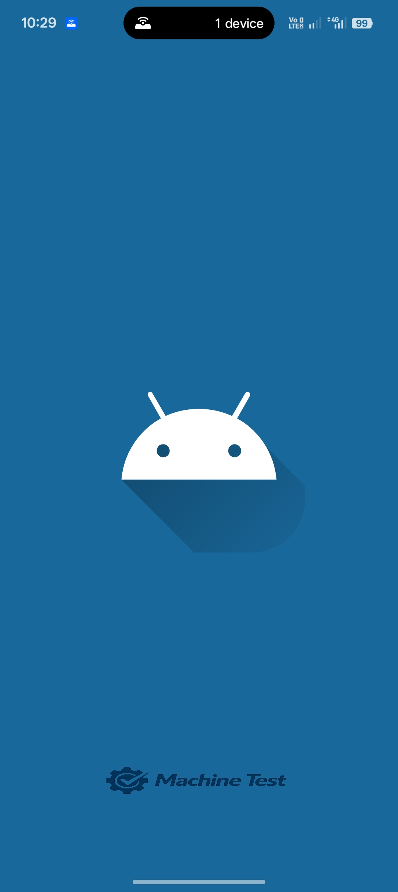
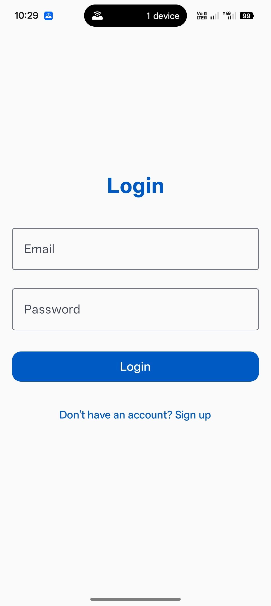
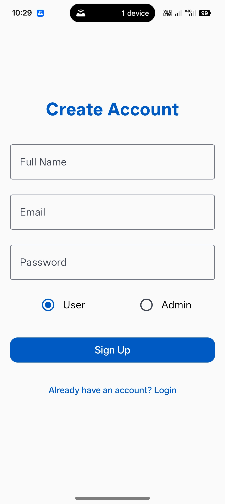
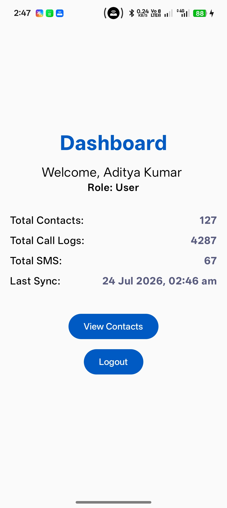
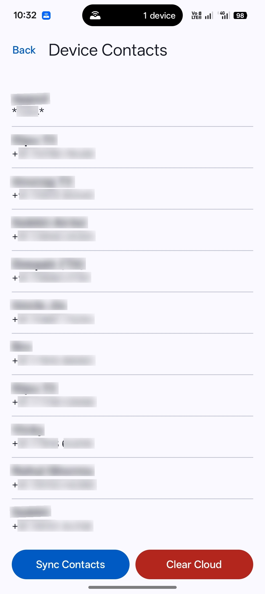
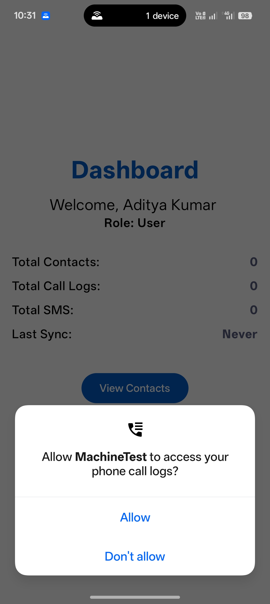

# MachineTest App

A modern Android application demonstrating **Clean Architecture**, **Jetpack Compose**, and **Firebase integration**. This project is designed to showcase best practices in Android development, including role-based authentication and custom splash screen animations.

---

## 🏛 Architecture Overview

The app follows **Clean Architecture** principles combined with the **MVVM (Model-View-ViewModel)** design pattern. This ensures the codebase is scalable, maintainable, and testable.

- **Presentation Layer**: Built with **Jetpack Compose** for a declarative UI. ViewModels handle UI state using `StateFlow` and interact with the Domain layer.
- **Domain Layer**: Contains the core business logic, including **Data Models** and **Use Cases** (if applicable). It is independent of any other layer.
- **Data Layer**: Implements the repository pattern to manage data from **Firebase (Firestore & Auth)**.

---

## ⚙️ Project Setup Instructions

Follow these steps to get the project running on your local machine:

1.  **Prerequisites**:
    - Android Studio Ladybug (or newer)
    - JDK 11 or higher
    - Android SDK 34+
2.  **Clone the Repository**:
    ```bash
    git clone https://github.com/your-username/MachineTest.git
    ```
3.  **Open in Android Studio**:
    - Launch Android Studio and select **Open**.
    - Navigate to the cloned directory and click **OK**.
4.  **Sync Gradle**: Wait for Android Studio to finish syncing dependencies.
5.  **Run the App**: Connect an emulator or physical device and click the **Run** button.

---

## 🔥 Firebase Configuration Steps

To enable authentication and database features, you must link the app to your Firebase project:

1.  **Create a Firebase Project**: Go to the [Firebase Console](https://console.firebase.google.com/) and create a new project.
2.  **Add Android App**:
    - Register the app with package name: `com.example.machinetest`.
    - Download the `google-services.json` file.
3.  **Add Configuration File**: Place the `google-services.json` file inside the `app/` folder of the project.
4.  **Enable Services**:
    - **Authentication**: Enable **Email/Password** and **Google** (if used) sign-in methods.
    - **Cloud Firestore**: Create a database in **Test Mode** (or configure security rules).
5.  **Admin Secret Key**: In Firestore, create a collection (e.g., `admin_config`) with a document containing a `secretKey` field to verify Admin registrations. the secretKey=pass123

---

## 📚 Libraries Used

This project leverages industry-standard libraries for robust performance:

- **UI & Layout**:
  - [Jetpack Compose](https://developer.android.com/jetpack/compose): Modern toolkit for building native UI.
  - [Material 3](https://developer.android.com/jetpack/androidx/releases/compose-material3): Latest Material Design components.
- **Dependency Injection**:
  - [Hilt](https://dagger.dev/hilt/): Simplifies Dagger-based DI for Android.
- **Backend & Persistence**:
  - [Firebase Auth](https://firebase.google.com/docs/auth): Secure user authentication.
  - [Cloud Firestore](https://firebase.google.com/docs/firestore): NoSQL cloud database.
- **Navigation**:
  - [Navigation Compose](https://developer.android.com/jetpack/compose/navigation): Navigation between screens in Compose.
- **Image Loading**:
  - [Coil](https://coil-kt.github.io/coil/): Kotlin-first image loading library.
- **Asynchronous Tasks**:
  - [Coroutines](https://kotlinlang.org/docs/coroutines-overview.html): Manage background tasks.
  - [Flow](https://kotlinlang.org/docs/flow.html): Stream data asynchronously.
- **Other Utilities**:
  - [Splash Screen API](https://developer.android.com/develop/ui/views/launch/splash-screen): Native splash screen support for Android 12+.

---

## 📱 Screenshots

| Splash Screen | Login Screen | Signup Screen |
| :---: | :---: | :---: |
|  |  |  |

| Home Screen | Contact View | Permission |
| :---: | :---: | :---: |
|  |  |  |

---
Developed with ❤️ by Aditya
